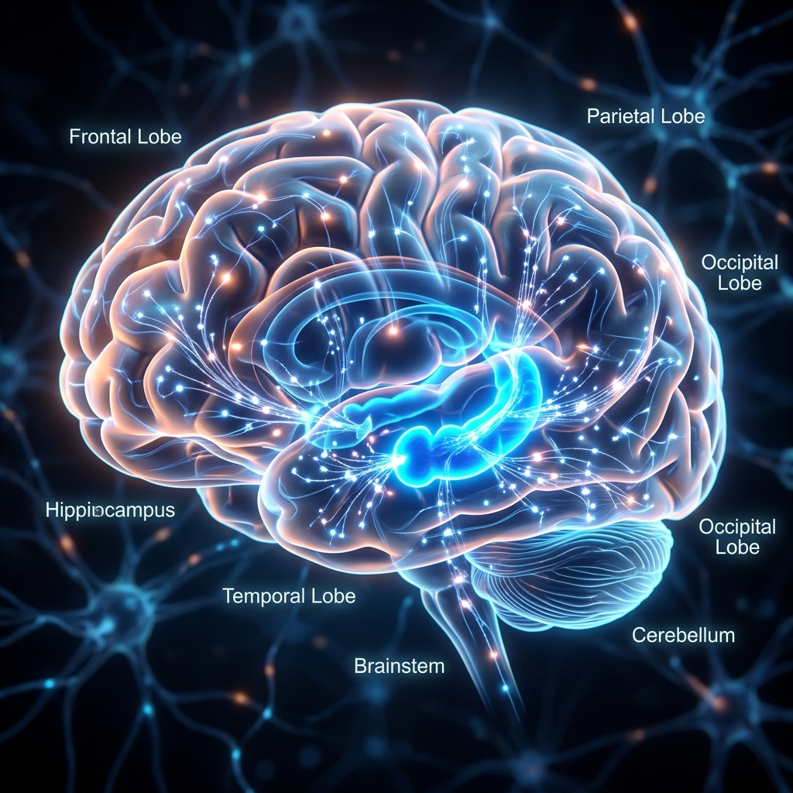
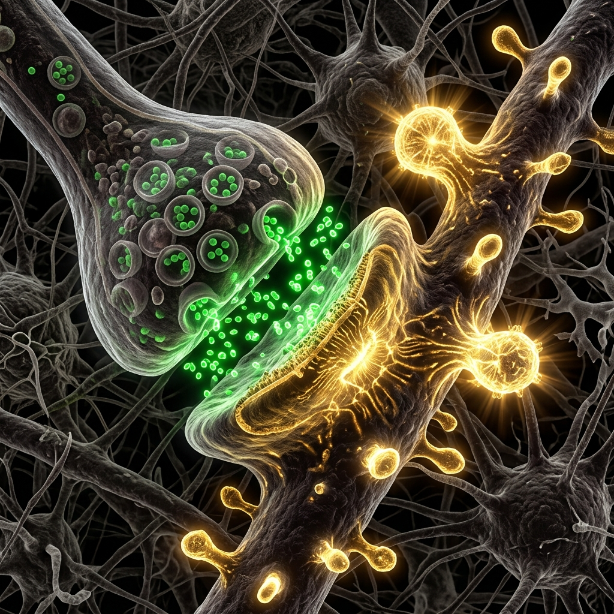
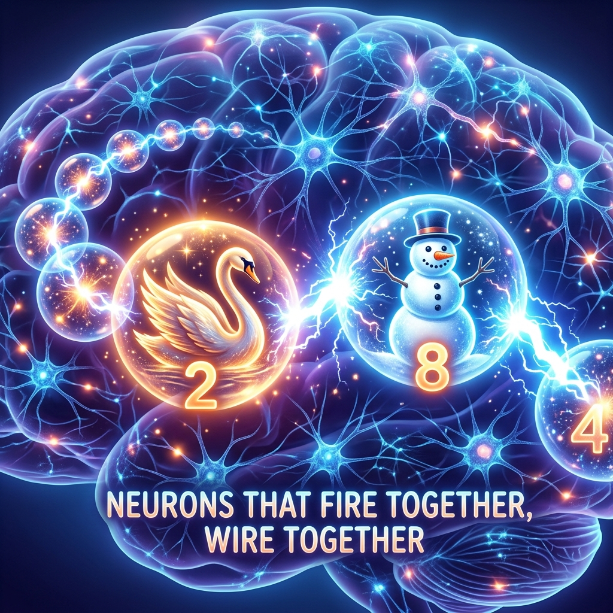
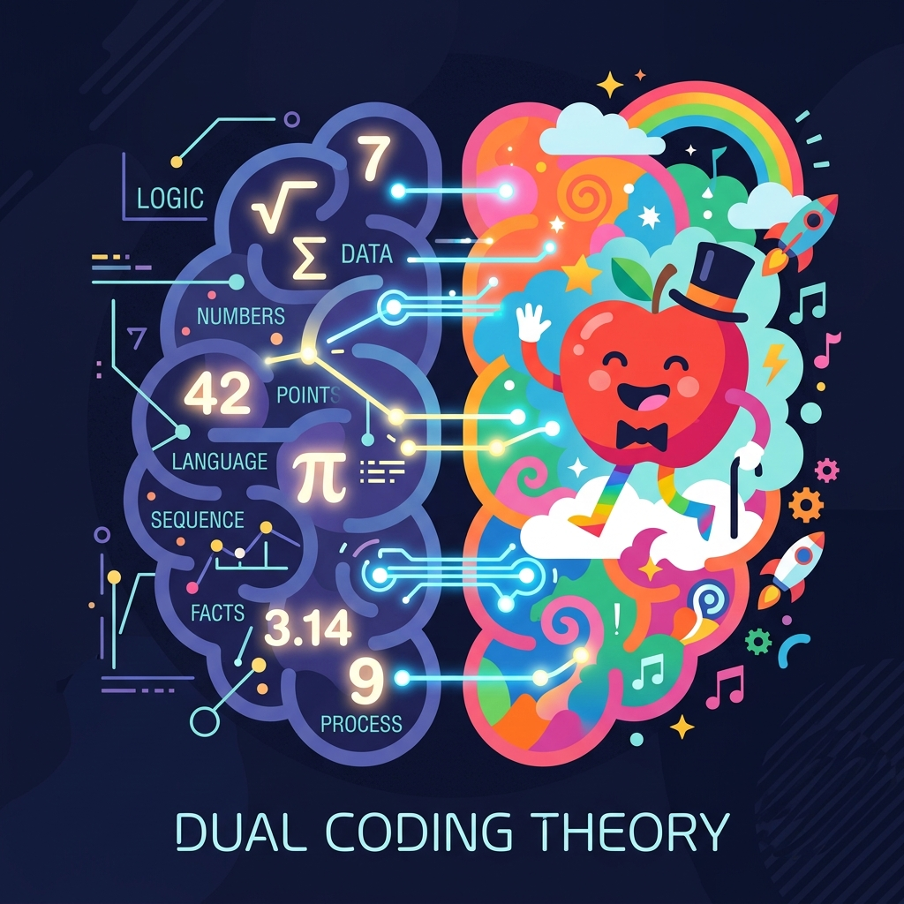
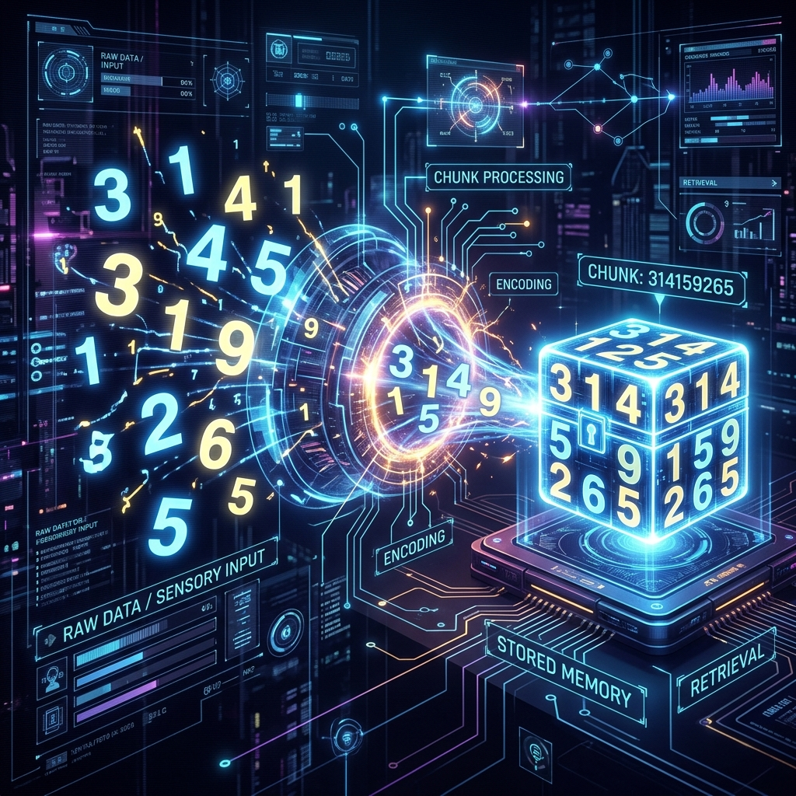
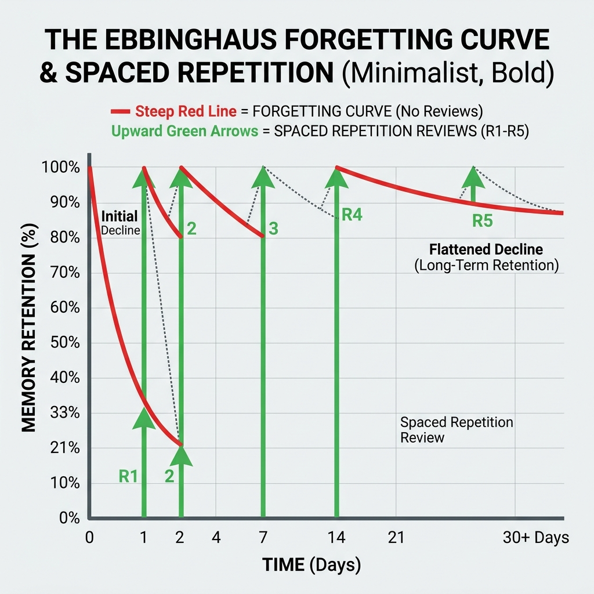

# 數字鎖鏈記憶法：認知心理學與腦神經科學原理
(Number Chain Mnemonic Method: Cognitive Psychology and Neuroscience Principles)

「數字鎖鏈」是一套強大且高效的記憶法，它將抽象的數字轉化為生動的圖像與故事。這不僅僅是記憶技巧，其背後有著扎實的**認知心理學**與**腦神經科學**基礎。本文件將為您解析這套系統為何如此有效，以及它如何改變我們大腦的學習方式。

---

## 1. 腦神經科學觀點：記憶在生物學上的運作

### 1.1 海馬迴 (The Hippocampus)：大腦的記憶樞紐
海馬迴位於大腦顳葉深處，負責將短期記憶轉化為長期記憶。當我們學習新資訊時，資訊會先經由大腦皮層處理，隨後傳送至海馬迴。海馬迴的作用類似於一台精密的索引系統，能將各種感官體驗（視覺、聽覺、情感等）綁定成一個完整的記憶痕跡。

在「數字鎖鏈」中，我們將枯燥的數字轉化為多重感官的圖像與故事情節。相較於抽象符號，大腦天生更擅長記憶空間與生動的事件，因此這種圖像化直接喚醒了海馬迴的最佳運作模式。

### 1.2 神經可塑性與長期增強作用 (Long-Term Potentiation, LTP)
記憶並非儲存於單一「記憶細胞」，而是建立在神經網絡之間的連結上。**神經可塑性 (Synaptic Plasticity)** 是神經元突觸連結根據活躍程度變強或變弱的能力，這也是學習與記憶的根本生物機制。

著名的神經科學法則：「**一起激發的神經元，會連接在一起 (Neurons that fire together, wire together)**」，正是長期增強作用 (LTP) 的核心。當你生動地想像「天鵝（代表數字 2）」與「雪人（代表數字 8）」產生互動時，代表這兩個概念的神經迴路被同時激發。這種同步激發改變了突觸的結構，讓未來的訊號傳遞變得更容易。

---

## 2. 認知心理學觀點：為什麼這個 App 有效？

### 2.1 雙碼理論 (Dual Coding Theory) 與 圖像記憶
Allan Paivio 的雙碼理論指出，大腦利用「視覺」和「語文」兩種不同的通道來處理資訊。數字鎖鏈法透過將抽象數字（語文/符號）轉換為生動甚至荒誕的圖像（視覺），充分利用了雙重通道，讓大腦產生更豐富、更穩固的記憶表徵。

### 2.2 意元集組 (Chunking)：突破短期記憶限制
人類的短期工作記憶容量有限（著名的「神奇數字 7±2」）。**意元集組 (Chunking)** 是將零散的資訊結合成更大、有意義的記憶單位。數字鎖鏈法將一長串無意義的數字轉化為一連串的人物、動作與物品。原本需要記憶 10 個獨立單元的負擔，瞬間被壓縮成「一個」連貫的故事情節。

### 2.3 艾賓浩斯遺忘曲線 (Ebbinghaus Forgetting Curve) 與 間隔複習
艾賓浩斯的研究表明，如果沒有刻意複習，記憶會隨著時間迅速流失。NChain App 透過內建的**間隔複習 (Spaced Repetition)** 機制，在記憶即將衰退的關鍵節點提醒使用者進行複習。每一次複習都會重新鞏固神經連結，並使遺忘曲線變得越來越平緩，最終進入長期記憶。

### 2.4 主動回想 (Active Recall)
被動地閱讀資訊，效果遠不如主動從大腦中提取記憶（Active Recall）。App 在測驗與複習時，要求使用者主動回想「數字對應的圖像」或「故事的下一個環節」。這種「提取練習」能顯著增強突觸的 LTP 效應，讓大腦的記憶路徑更加粗壯。

---

## 總結

**NChain 數字鎖鏈 Web App** 不僅僅是一個工具，它是建立在紮實認知心理學與腦神經科學基礎上的學習系統。透過圖像化（雙碼理論）與故事化（意元集組），我們能優化大腦海馬迴的資訊編碼；再透過系統性的間隔複習與主動回想，我們能最大化神經元的長期增強作用 (LTP)。這正是這套方法能讓人輕鬆記憶海量數字的科學奧秘！
